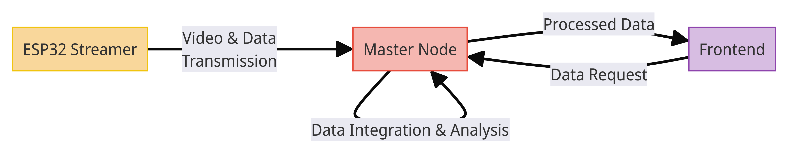
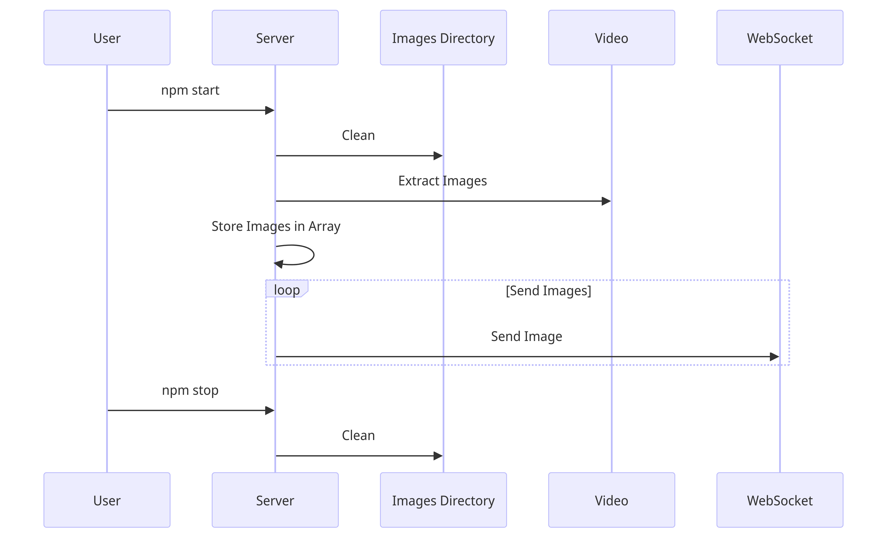

Hive Guard is a real-time beekeeping monitor. It collects data, analyzes it, stores it, and presents it. It offers live video, environmental data, object detection, and more, making beekeeping modern and efficient.



## Hive Guard mock ESP32-streamer
This program acts as an ESP32 streamer, under the HIVE GUARD architecture, sending constant mock sensor and video data.

## Usage

This is a simple Node.js application. To run the application, navigate to the project directory and execute the following command:

```bash
npm start
```

This command will start the server and clean the images directory. The server will extract images from a video file and send them in a loop via a WebSocket connection.  To stop the server and clean the images directory, use the following command:

```bash
npm stop
```

You can add your own videos to the project to test the flow. Place your video file in the `.video` directory. The server will extract images from these videos and send them in a loop via a WebSocket connection.

The video currently being used is from [BeeAlarmed](https://github.com/BeeAlarmed/BeeAlarmed.git) by Fabian Hickert.

## Implementation Details
- The server uses the `ffmpeg` library to extract images from a video file at startup. 

- These images are stored in an array and sent in a loop via a WebSocket connection. 

- The rate at which images are sent can be adjusted by changing the interval time in the `setInterval` function in the `sendImages` function.  

- The images directory is cleaned up at server startup and shutdown. This is done by reading all the files in the directory and deleting them one by one. 

- This prevents the images directory from growing indefinitely and ensures that old images do not interfere with new ones.  

- The `npm start` and `npm stop` commands are used to start and stop the server, respectively. 

- These commands also handle the cleanup of the images directory. 

- The start command runs the `on_server_startup.js` script, which cleans the images directory and then starts the server. 

- The stop command runs the `on_server_shutdown.js` script, which cleans the images directory and then stops the server.

## Prerequisites

This project uses FFmpeg library. Make sure you have it installed on your system. If you encounter an error like `Output format mjpeg is not available`, it means that the required codec is not installed or enabled in your FFmpeg installation.

You can check the codecs supported by your FFmpeg installation by running the following command in your terminal:

```bash
ffmpeg -codecs
```

If 'mjpeg' is not listed, you will need to install it. This usually involves recompiling FFmpeg with the required codec. The process can be complex and depends on your operating system.

If you're using a package manager like Homebrew on a Darwin machine, you might need to uninstall the current version of FFmpeg and reinstall it with the required codecs. Here's how you might do it:

```bash
brew uninstall ffmpeg
brew install ffmpeg --with-libvpx --with-libvorbis --with-fdk-aac --with-opus --with-theora --with-tools --with-libx264 --with-libx265 --with-libvpx --with-libvorbis --with-libfdk-aac --with-opus --with-theora --with-tools
```

Please note that the above command includes a number of codecs, not just 'mjpeg'. You should adjust the command to suit your needs.